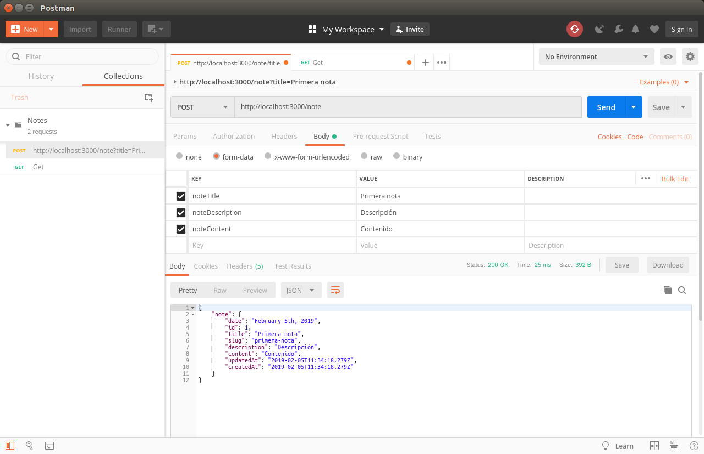
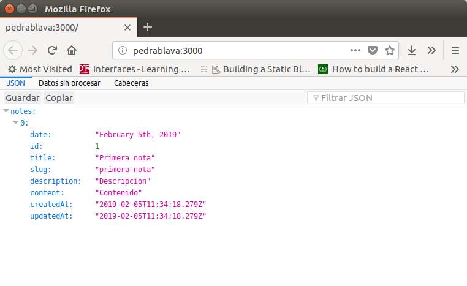
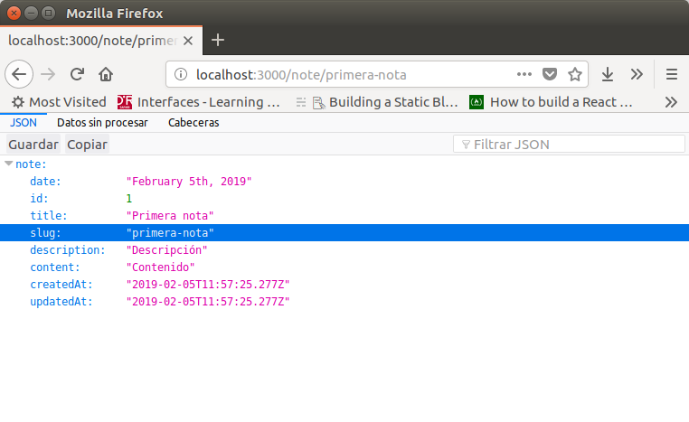
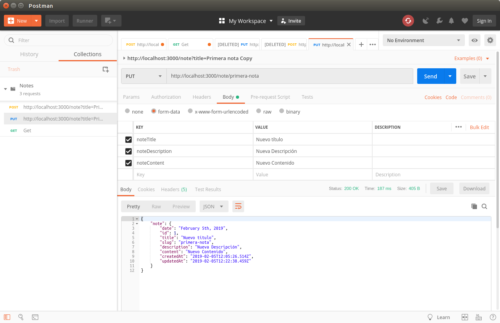
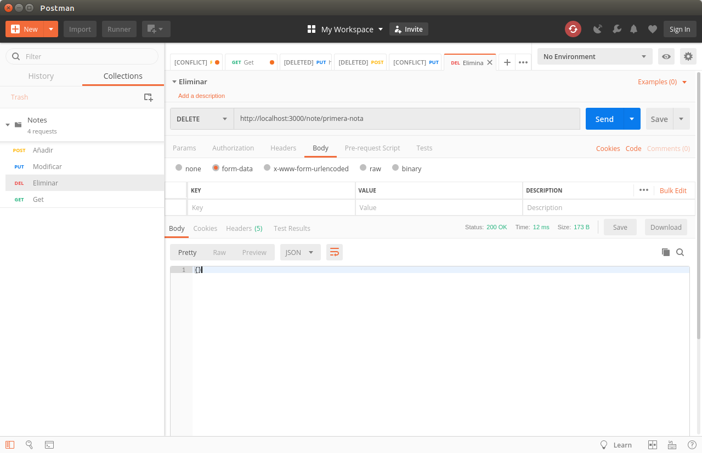
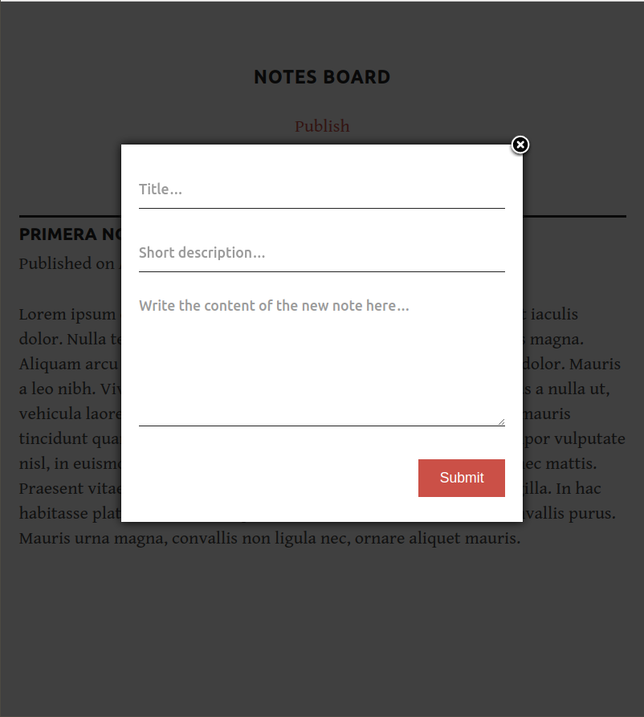
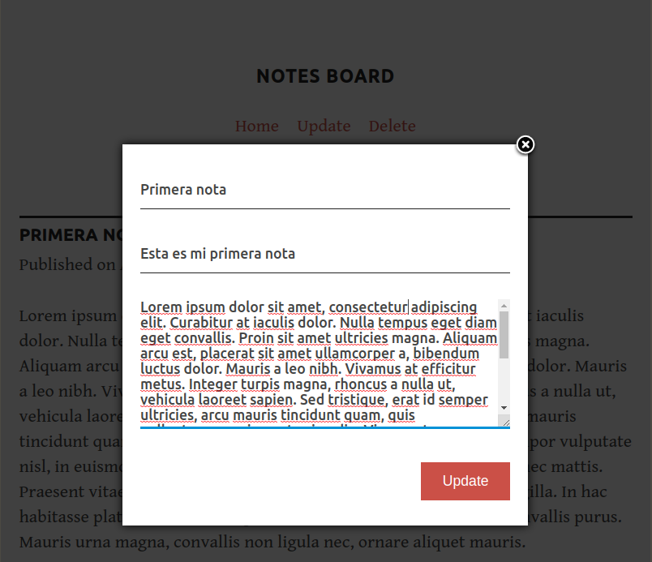

Poner en el aula virtual package.json y package.lock

# Instalación de node

Para instalar `node.js` 

```
sudo apt install nodejs
```

Y para instalar el gestor de paquetes `nmp` 

```
sudo apt install npm
```

Además vamos a instalar `nodemon`  para que rearranque automáticamente el servidor al realizar cualquier cambio en un archivo de la aplicación.

```
sudo npm install -g nodemon
```

## Nuestra primera aplicación en Node.js

Crea un fichero llamado `hello.js` con el siguiente contenido:

```javascript
console.log("Hello, World!");
```

Esto utiliza el módulo de consola integrado de `Node.js` para mostrar un mensaje en un terminal. Para ejecutar el ejemplo, escribe el siguiente comando:

```
node hello.js
```

Si todo está correctamente instalado, producirá la siguiente salida:

>  Hello, World!

## 1 El modelo de ejecución de Node.js

En términos muy simplistas, cuando se conecta a un servidor tradicional, como Apache, generará un nuevo hilo para manejar la solicitud. En un lenguaje como PHP o Ruby, cualquier operación de E/S subsiguiente (por ejemplo, interactuar con un base de datos) bloquea la ejecución de tu código hasta que la operación haya finalizado. Es decir, el servidor debe esperar a que se complete la búsqueda de la base de datos antes de poder pasar a procesar el resultado. Si llegan nuevas solicitudes mientras esto está sucediendo, el servidor generará nuevos hilos para tratar con ellos. Esto es potencialmente ineficiente, ya que una gran cantidad de subprocesos puede hacer que un sistema se vuelva lento y, en el peor de los casos, que el sitio caiga. La forma más común de admitir más conexiones es agregar más servidores.

`Node.js`, sin embargo, es de un solo hilo. También está dirigido por eventos, lo que significa que todo lo que sucede en `Node` es una reacción a un evento. Por ejemplo, cuando un llega una nueva solicitud (un tipo de evento) el servidor comenzará a procesarla. Si luego encuentra una operación de bloqueo de E/S, en lugar de esperar a que esta se complete, registrará una devolución de llamada antes de continuar procesando el próximo evento. Cuando la operación de E/S ha finalizado (otro tipo de evento), el servidor ejecutará la devolución de llamada (callback) y continuará trabajando en la solicitud original. Entre bambalinas, Node utiliza la biblioteca **libuv** para implementar este comportamiento asíncrono (es decir, sin bloqueo).

El modelo de ejecución de Node causa al servidor una pequeña sobrecarga y, por lo tanto, es capaz de manejar un gran número de conexiones simultáneas. El enfoque tradicional para escalar una aplicación Node es clonarlo y hacer que las instancias clonadas compartan la carga de trabajo. Node.js incluso tiene un módulo incorporado para ayudarlo a implementar una estrategia de clonación en un solo servidor.

La siguiente imagen muestra el modelo de ejecución de Node:


**¿Hay desventajas?**

El hecho de que Node se ejecute en un solo hilo impone algunas limitaciones. Por ejemplo, se debe evitar el bloqueo de llamadas de E/S y los errores siempre deben manejarse correctamente ya que de lo contrario falla todo el proceso (es decir, el servidor se cae). A algunos desarrolladores también les disgusta el estilo de codificación basado en la devolución de llamada que impone JavaScript (hasta el punto de que incluso hay un sitio dedicado a los [horrores de escribir JavaScript asíncrono](http://callbackhell.com/)). Pero con la llegada de las promesas nativas, seguidas de cerca por `async await` (que está habilitada de forma predeterminada a partir de la versión 7.6 de Node), esto se está convirtiendo rápidamente en una cosa del pasado.

## 2 “Hello, World!” — Versión servidor

Vamos a ver un ejemplo básico de un servidor:

```javascript
const http = require('http');
http.createServer((request, response) => {
    response.writeHead(200);
    response.end('Hello, World!');
}).listen(3000);
console.log('Server running on http://localhost:3000');
```

Para ejecutar esto, copia el código en un archivo llamado `hello-world-server.js` y ejecútalo usando 

```
node hello-world-server.js
```

Abre un navegador y navega a http://localhost:3000 para ver "Hello, World!" en el navegador.

**Ahora echemos un vistazo al código.**

1. Comenzamos requiriendo el módulo `HTTP` nativo de Node. Luego usamos su método `createServer` para crear un nuevo objeto de servidor web, al que le pasamos una función anónima. Esta función se invocará para cada nueva conexión que se realice al servidor.

2. La función anónima se llama con dos argumentos (`request` y `response`) que contienen la solicitud del usuario y la respuesta, que usamos para devolver un código de estado `HTTP 200`, junto con nuestro mensaje "Hello, World!".

3. Finalmente, le pedimos al servidor que escuche las solicitudes entrantes en el puerto **3000** y envíe un mensaje al terminal para informarnos que se está ejecutando.

Obviamente, hay mucho más para crear incluso un servidor simple en Node (por ejemplo, es importante manejar los errores correctamente), por lo que te recomiendo que consultes la [documentación](https://nodejs.org/en/docs/guides/anatomy-of-an-http-transaction/) si deseas obtener más información.

## 3 Fundamentos de nuestra aplicación de notas

<video src="./assets/notas.m4v" controls='controls'/>

Vamos a construir la funcionalidad básica de una aplicación para tomar notas usando la arquitectura MVC. Vamos a utilizar el framework de [Hapi.js](https://hapijs.com/) para Node.js y [SQLite](https://www.sqlite.org/index.html) como base de datos, utilizando [Sequelize.js](https://sequelize.readthedocs.io/en/v3/), además de otras pequeñas utilidades para acelerar nuestro desarrollo. Vamos a construir las vistas usando [Pug](https://pugjs.org/api/getting-started.html), el lenguaje de las plantillas.

El primer paso al crear cualquier aplicación Node.js es crear un archivo `package.json`, que contendrá todas nuestras dependencias y scripts. En lugar de crear este archivo manualmente, `npm` puede hacer el trabajo por nosotros usando el comando `init`:

```
npm init -y
```

El contenido del archivo es el siguiente:

```json
{
  "name": "dwes-node-js",
  "version": "1.0.0",
  "description": "",
  "main": "hello-word-server.js",
  "scripts": {
    "test": "echo \"Error: no test specified\" && exit 1"
  },
  "repository": {
    "type": "git",
    "url": "git+https://github.com/victorponz/dwes-node-js.git"
  },
  "keywords": [],
  "author": "",
  "license": "ISC",
  "bugs": {
    "url": "https://github.com/victorponz/dwes-node-js/issues"
  },
  "homepage": "https://github.com/victorponz/dwes-node-js#readme"
}
```

Vamos a proceder a instalar `Hapi.js`, el framework de elección para este tutorial. Proporciona un buen equilibrio entre simplicidad, estabilidad y disponibilidad de funciones que funcionará bien para nuestro caso de uso (aunque hay otras opciones que también funcionarán bien).

```
npm install --save hapi
```

Este comando descargará la última versión de `Hapi.js` y la agregará a nuestro archivo `package.json` como una dependencia.

Ahora podemos crear nuestro archivo de entrada, el servidor web que iniciará todo. Continúa y crea un archivo `server.js` en tu directorio de aplicación y con todo el siguiente código:

```javascript
const Hapi = require('hapi');
const Settings = require('./settings');
const server = new Hapi.Server({ port: Settings.port });
server.route({
    method: 'GET',
    path: '/',
    handler: (request, h) => 'Hello, World!'
});
const init = async () => {
    await server.start();
    console.log(`Server running at: ${server.info.uri}`);
};
process.on('unhandledRejection', (err) => {
    console.log(err);
    process.exit(1);
});
init();
```

Esta será la base de nuestra aplicación.

1. Primero, incluimos nuestras dependencias y creamos una instancia de un nuevo objeto de servidor donde configuramos el puerto de conexión a lo que declaremos en nuestro archivo de configuración. Usaremos el puerto **3000** aunque este puede ser cualquier número por encima de **1023** y por debajo de **65535**. 
   La primera ruta para nuestro servidor funcionará como una prueba para ver si todo funciona, por lo que un mensaje de "Hello, World!" es suficiente para nosotros.

2. En cada ruta, tenemos que definir el método HTTP y la ruta (URL) a la que responderá, así como un controlador, que es una función que procesará la solicitud HTTP. La función de manejador puede tomar dos parámetros. La primera, `request`, contiene información sobre la llamada HTTP. El segundo es algo que se llama el kit de herramientas de respuesta ([response toolkit](https://hapijs.com/api/#response-toolkit)), un objeto que contiene propiedades y utilidades para cuidar la respuesta. Este parámetro a menudo se reduce a `h`.

3. A continuación, creamos una función asíncrona desde la cual podemos iniciar nuestro servidor usando el método `server.start`. Luego, registramos un mensaje en la consola que indica que el servidor se está ejecutando e incluimos un código básico de manejo de errores, antes de iniciar el proceso llamando al método `init`.

## 4 Guardar nuestras configuraciones

Es una buena práctica almacenar nuestras variables de configuración en un archivo dedicado. Este archivo exporta un objeto JSON que contiene nuestros datos, donde cada clave se asigna desde una variable de entorno, pero sin olvidar un valor de reserva. En este archivo, también podemos tener diferentes configuraciones dependiendo de nuestro entorno (por ejemplo, desarrollo o producción). Por ejemplo, podemos tener una instancia en memoria de SQLite para fines de desarrollo, pero un archivo de base de datos real de SQLite para producción.

Seleccionar los ajustes en función del entorno actual es bastante simple. Ya que también tenemos una variable `env` en nuestro archivo que contendrá desarrollo o producción, podemos hacer algo como lo siguiente para obtener la configuración de la base de datos (por ejemplo):

Crea un archivo `settings.js` en la raíz del proyecto y agrega el siguiente código:

```javascript
// Uncomment the next line to load our .env file and add the values to process.env
// require('dotenv').config({ silent: true });
module.exports = {
    port: process.env.PORT || 3000,
    env: process.env.ENV || 'development',
    // Environment-dependent settings
    development: {
        db: {
            dialect: 'sqlite',
            storage: ':memory:',
            operatorsAliases: false,
        },
    },
    production: {
        db: {
            dialect: 'sqlite',
            storage: 'db/database.sqlite',
            operatorsAliases: false,
        },
    },
};
```

Ahora podemos iniciar nuestra aplicación ejecutando el siguiente comando y navegando a http://localhost:3000 en nuestro navegador web.

```
nodemon server.js
```

## 5 Definir las rutas

La definición de rutas nos da una visión general de la funcionalidad admitida por nuestra aplicación. Para crear nuestras rutas adicionales, solo tenemos que replicar la estructura de la ruta que ya tenemos en nuestro archivo `server.js`, cambiando el contenido de cada una.

Comencemos creando un nuevo directorio llamado **lib** en nuestro proyecto. Aquí vamos a incluir todos los componentes de JS. Dentro de **lib**, creamos un archivo `routes.js` y agregamos el siguiente contenido:

```javascript
module.exports = [
	// Aquí definiremos las rutas
];
```

En este archivo, exportaremos un array de objetos que contiene cada ruta de nuestra aplicación. Para definir la primera ruta, agrega el siguiente objeto al array:

```javascript
{
    method: 'GET',
        path: '/',
        handler: (request, h) => {
            return 'All the notes will appear here';
        },
        config: {
        	description: 'Gets all the notes available'
    	}
},
```

Nuestra primera ruta es para la página de inicio (`/`) y como solo devolverá información, le asignamos un método `GET`. Por ahora, solo nos dará el mensaje. Todas las notas aparecerán aquí, las cuales cambiaremos más adelante para una función de controlador. El campo de descripción en la sección de configuración es solo para fines de documentación.
A continuación, podemos crear las cuatro rutas para nuestras notas en la ruta `/note/`. Dado que estamos construyendo una aplicación [CRUD](https://en.wikipedia.org/wiki/Create,_read,_update_and_delete), necesitaremos una ruta para cada acción con el [método HTTP](https://www.w3schools.com/tags/ref_httpmethods.asp) correspondiente.

Añade las siguientes definiciones a la ruta anterior:

```javascript
    {
        method: 'POST',
        path: '/note',
        handler: (request, h) => {
            return 'New note';
        },
        config: {
            description: 'Adds a new note'
        }
    },
    {
        method: 'GET',
        path: '/note/{slug}',
        handler: (request, h) => {
            return 'This is a note';
        },
        config: {
            description: 'Gets the content of a note'
        }
    },
    {
        method: 'PUT',
        path: '/note/{slug}',
        handler: (request, h) => {
            return 'Edit a note';
        },
        config: {
            description: 'Updates the selected note'
        }
    },
    {
        method: 'DELETE',
        path: '/note/{slug}',
        handler: (request, h) => {
            return 'This note no longer exists';
        },
        config: {
            description: 'Deletes the selected note'
        }
    },
```

Hemos hecho lo mismo que en la definición de ruta anterior, pero esta vez hemos cambiado el método para que coincida con la acción que queremos ejecutar.

Podemos nombrar parámetros en la ruta rodeando la palabra entre corchetes `{...}`. Como vamos a identificar las notas por un [slug](https://prettylinks.com/2018/03/url-slugs/), agregamos `{slug}` a cada ruta, con la excepción de la ruta `PUT`. No lo necesitamos allí, porque no vamos a interactuar con una nota específica, sino a crear una.

Puedes leer más sobre las rutas de Hapi.js en la [documentación oficial](https://hapijs.com/tutorials/routing).

Ahora, tenemos que agregar nuestras nuevas rutas al archivo `server.js`. Importamos el archivo de rutas en la parte superior del archivo:

```javascript
const Routes = require('./lib/routes');
```

y reemplaza nuestra ruta de prueba actual con lo siguiente:

```javascript
server.route(Routes);
```

Para verificar que las cosas funcionan, reinicia el servidor y luego intenta visitar un par de las nuevas rutas `GET`: http://localhost:3000/ o http://localhost:3000/note/1 

El resto de rutas las probaremos más adelante con [Postman](https://www.getpostman.com/)

## 6 Crear los modelos

Los modelos nos permiten definir la estructura de los datos y todas las funciones para trabajar con ellos.
En este ejemplo, vamos a utilizar la base de datos `SQLite` con `Sequelize.js`, que nos proporcionará una mejor interfaz mediante la técnica **ORM** (Mapeo Relacional de Objetos). También nos proporcionará una interfaz independiente de la base de datos.

### 6.1 Configurando la base de datos

Para esta sección, vamos a utilizar los paquetes `Sequelize.js` y `SQlite`. Puedes instalarlos e incluirlos como dependencias ejecutando el siguiente comando:

```
npm install -s sequelize sqlite3
```

Ahora crea un directorio de modelos `models` dentro del directorio `lib` y agrega un archivo llamado `index.js`. Esto contendrá la base de datos y la configuración de `Sequelize.js`. Agrega el siguiente contenido:

```javascript
const Fs = require('fs');
const Path = require('path');
const Sequelize = require('sequelize');
const Settings = require('../../settings');

// Database settings for the current environment
const dbSettings = Settings[Settings.env].db;
const sequelize = new Sequelize(
    dbSettings.database, dbSettings.user, dbSettings.password, dbSettings
);
const db = {};
// Read all the files in this directory and import them as models
Fs.readdirSync(__dirname)
    .filter(file => (file.indexOf('.') !== 0) && (file !== 'index.js'))
    .forEach((file) => {
        const model = sequelize.import(Path.join(__dirname, file));
        db[model.name] = model;
    });
db.sequelize = sequelize;
db.Sequelize = Sequelize;
module.exports = db;
```

1.  Incluimos los módulos que vamos a utilizar:

	* `Fs`, para leer los archivos dentro de la carpeta de modelos, que contendrá todos los modelos.
	* `Path`, para unir la ruta de cada archivo en el directorio actual.
	* `Sequelize`, que nos permitirá crear una nueva instancia de Sequelize.
	* `Settings`, que contiene los datos de nuestro archivo `settings.js` desde la raíz de nuestro proyecto.

2. A continuación, creamos una nueva variable de `Sequelize` que contendrá una instancia de `Sequelize` con nuestra configuración de base de datos para el entorno actual. Vamos a utilizar `Sequelize` para importar todos los modelos y ponerlos a disposición en nuestro objeto `db`.

3. El objeto `db` se va a exportar y contendrá nuestros métodos de base de datos para cada modelo; estará disponible en nuestra aplicación cuando tengamos que hacer algo con nuestros datos.

4. Para cargar todos los modelos, en lugar de definirlos manualmente, buscamos todos los archivos dentro del directorio `models` (con la excepción del archivo `index.js`) y los cargamos usando la función `require`. El objeto devuelto nos proporcionará los métodos CRUD, que luego agregaremos al objeto `db`.

5. Al final, agregamos las propiedades `sequelize` y `Sequelize` a nuestro objeto `db`. El primero se usa en nuestro servidor `server.js` para una base de datos antes de iniciar el servidor, y el segundo se incluye para tu comodidad.

## 7 Creando nuestro modelo de nota

En esta sección, vamos a utilizar el paquete `Moment.js` para ayudar con el formato de fecha. Puedes instalarlo e incluirlo como una dependencia con el siguiente comando:

```
npm install -s moment
```

Ahora, vamos a crear un archivo `note.js` dentro del directorio `models`, que será el único modelo en nuestra aplicación. Nos proporcionará toda la funcionalidad que necesitamos.

Agrega el siguiente contenido a ese archivo:

```javascript
const Moment = require('moment');
module.exports = (sequelize, DataTypes) => {
    const Note = sequelize.define('Note', {
        date: {
            type: DataTypes.DATE,
            get() {
                return Moment(this.getDataValue('date')).format('MMMM Do, YYYY');
            },
        },
        title: DataTypes.STRING,
        slug: DataTypes.STRING,
        description: DataTypes.STRING,
        content: DataTypes.STRING,
    });
    return Note;
};
```

1. Exportamos una función que acepta una instancia `sequelize`, para definir el modelo y un objeto `DataTypes` con todos los tipos disponibles en nuestra base de datos.

2. A continuación, definimos la estructura de nuestros datos utilizando un objeto donde cada clave corresponde a una columna de base de datos y el valor de la clave define el tipo de datos que vamos a almacenar. Puedes ver la lista de tipos de datos en la [documentación de Sequelize.js](http://docs.sequelizejs.com/variable/index.html#static-variable-DataTypes). Las tablas en la base de datos se crearán automáticamente en función de esta información.
   En el caso de la columna de fecha, también definimos cómo `Sequelize` debería devolver el valor utilizando una función `getter` (get key). Indicamos que antes de devolver la información, primero se debe pasar a través de la utilidad `Moment` para que se formatee de una manera más legible (MMMM Do, YYYY).

3. Finalmente, devolvemos el modelo (`Note`).

Ahora que hemos terminado nuestros modelos, a continuación, sincronizaremos nuestra base de datos para que podamos usarla en la aplicación.

## 8 Sincronizar la base de datos

Ahora, tenemos que sincronizar nuestra base de datos antes de poder utilizarla en nuestra aplicación. En `server.js`, importa los modelos en la parte superior del archivo:

```javascript
const Models = require('./lib/models/');
```

A continuación, envuelve (wrap) el siguiente método de llamada:

```javascript
init();
```

con una llamada a `Models.sequelize.sync`, así:

```javascript
Models.sequelize.sync().then(() => {
	init();
});
```

Este código sincronizará los modelos con nuestra base de datos y, una vez hecho esto, el método `init` iniciará todo. Hacer las cosas de esta manera significa que no saturamos la aplicación mientras utilizamos las funciones de `Sequelize`.

## 9 Crear los controladores

Los controladores son funciones que aceptan el objeto `request` y el `response tool kit` de Hapi.js. El objeto `request` contiene información sobre el recurso solicitado y usamos métodos del kit de herramientas de respuesta para devolver información al cliente.

En nuestra aplicación, vamos a devolver solo un objeto JSON por ahora, pero agregaremos las vistas una vez que las construyamos.

Podemos pensar en los controladores como funciones que unirán nuestros modelos con nuestros puntos de vista; se comunicarán con nuestros modelos para obtener los datos y luego los devolverán dentro de una vista.

### 9.1 El controlador Home

El primer controlador que vamos a construir manejará la página de inicio de nuestro sitio.

Crea un directorio `lib/controllers` con un archivo `home.js` dentro, luego agrega el siguiente contenido:

```javascript
const Models = require('../models/');
module.exports = async (request, h) => {
    const notes = await Models.Note.findAll({
        order: [['date', 'DESC']],
    });
    return { notes };
};
```

1. Obtenemos todas las notas en nuestra base de datos utilizando el método `findAll` de nuestro modelo.
   Esta función devolverá una promesa que, cuando se resuelva, nos dará un array que contiene todas las notas en nuestra base de datos.
   Podemos organizar los resultados en orden descendente, usando el parámetro de orden en el objeto de opciones pasado al método `findAll`, de modo que el primer elemento aparezca primero. Puedes consultar todas las opciones disponibles en la documentación de Sequelize.js.

2. Finalmente devolvemos un objeto que contiene una propiedad de nota, cuyo valor es nuestro array de notas.

Una vez que tengamos el controlador `Home`, podemos editar nuestro archivo `routes.js`. Primero, importamos el módulo en la parte superior del archivo, junto con el módulo `Path`:

```javascript
const Path = require('path');
//Home es el nombre usado después en el handler de la ruta
const Home = require('./controllers/home');
```

Luego agregamos el controlador que acabamos de hacer al array:

```javascript
    {
        method: 'GET',
        path: '/',
        handler: Home,
        config: {
            description: 'Gets all the notes available'
        }
    },
```

Para comprobar que todo es correcto, visita la página http://localhost:3000. El resultado será un `json` vacío: 

```json
{"notes":[]}
```

### 9.2 Controlador para las Notas

Instalaremos el módulo `slugify`.

```
npm install -s slugify
```

El último controlador que tenemos que definir en nuestra aplicación nos permitirá crear, leer, actualizar y eliminar notas.

Podemos proceder a crear un archivo `note.js` dentro del directorio `lib/controllers` y agregar el siguiente contenido:

```javascript
const Path = require('path');
const Slugify = require('slugify');
const Models = require('../models/');
module.exports = {
    // Here we're going to include our functions that will handle each request
    // in the routes.js file.
};
```

####  9.2.1 `Create`

Para agregar una nota a nuestra base de datos, vamos a escribir una función de creación que incluirá el método de creación en nuestro modelo utilizando los datos contenidos en el objeto `payload` (payload son los datos enviados en la petición, por ejemplo, de un formulario).

Modifica `note.js`, para exportar el método `create`:

```java
const Path = require('path');
const Slugify = require('slugify');
const Models = require('../models/');
module.exports = {
    // Here we're going to include our functions that will handle each request
    // in the routes.js file.
    create: async (request, h) => {
        const note = await Models.Note
            .create({
                date: new Date(),
                title: request.payload.noteTitle,
                slug: Slugify(request.payload.noteTitle, { lower: true }),
                description: request.payload.noteDescription,
                content: request.payload.noteContent,
            });
        return { note }
    },
};
```

Ahora vamos a incluir este archivo en `routes.js` y a modificar el controlador. Añade la siguiente línea al principio del archivo.

```java
const Note = require('./controllers/note')
```

Y ahora modifica el `handler` para el método `POST` y ruta `note`:

```javascript
    {
        method: 'POST',
        path: '/note',
        handler: Note.create,
        config: {
            description: 'Adds a new note'
        }
    },
```

> **IMPORTANTE**
>
> Cada vez que modifiques código, recuerda reiniciar la aplicación. También se puede instalar el módulo [nodemon](https://www.npmjs.com/package/nodemon) que lo hace automáticamente por ti cada vez que guardas un archivo.

**Prueba de esta ruta.**

Para comprobar que podemos crear nuevas rutas, vamos a usar [Postman](https://www.getpostman.com/). Los datos que espera recibir son: `noteTitle`, `noteDescription` y `noteContent`, como podemos ver dentro del método `create`

En Postman, crea un nuevo `Request` y configúralo para enviar los datos. Si todo va bien, te debe devolver un objeto json con la nota recién creada.



Fijaos que os crea automáticamente un *slug* para vuestra nueva nota.

Si ahora visitas http://localhost:3000, verás que ya devuelve esta nota:



#### 9.2.2 `Read`

Vamos a crear la función `read`,  en `note.js`, que devolverá aquella nota cuyo `slug` sea el pasado como parámetro. En el caso del creado en el ejemplo, el slug será `primera-nota`. Para ello usamos el método `findOne`

```javascript
    read: async (request, h) => {
        const note = await Models.Note.findOne({
            where: { slug: request.params.slug },
        });
        return { note };
    },
```

Y ahora modificamos `routes.js` para cambiar el `handler` por `Note.read`:

```javascript
    {
        method: 'GET',
        path: '/note/{slug}',
        handler: Note.read,
        config: {
            description: 'Gets the content of a note'
        }
    },
```

Si ahora, accedemos a http://localhost:3000/note/primera-nota, veréis que **no devuelve nada!**.


Esto es así porque estamos guardando los datos en memoria y cada vez que reiniciamos, se pierden.
En el archivo `settings.js` se configura la base de datos en `development`como 

```sqlite
storage: ':memory:'
```

Vamos a modificarlo para que guarde la base de datos en un archivo físico que dejaremos en `db/notes.db`

Primero creamos el directorio `db` y dentro de él ejecutamos `sqlite3 notes.db`

Y modificamos el parámetro `storage`:

```sqlite
storage: 'db/notes.db',
```
Ahora ya podéis volver a realizar la petición `POST` desde Postman para que los datos se persistan en la base de datos y poder mantenerlos entre reinicios del servidor.



#### 9.2.3 `Update`

Para actualizar una nota, usamos el método de actualización en nuestro modelo. Se necesitan dos objetos, los nuevos valores que vamos a reemplazar y las opciones que contienen un filtro `where` con el slug de nota (que identifica la nota que vamos a actualizar).

```javascript
    update: async (request, h) => {
        const values = {
            title: request.payload.noteTitle,
            description: request.payload.noteDescription,
            content: request.payload.noteContent,
        };
        const options = {
            where: { slug: request.params.slug },
        };
        await Models.Note.update(values, options);
        const note = await Models.Note.findOne(options);
        return { note };
    },
```

Modificamos de nuevo `routes.js` para cambiar el `handler` por `Note.update`

```javascript
    {
        method: 'PUT',
        path: '/note/{slug}',
        handler: Note.update,
        config: {
            description: 'Updates the selected note'
        }
    },
```

Vamos a crear otra `Request` en Postman con el método `PUT`:

La ruta debe ser, http://localhost:3000/note/primera-nota

Y este es el resultado:




#### 9.2.4 `Delete`

El controlador para `delete` eliminará la nota al proporcionar el slug al método `destroy` de nuestro modelo.

Y devolverá una cadena vacía.

```javascript
    delete: async (request, h) => {
        await Models.Note.destroy({ where: { slug: request.params.slug } });
        return {};
    },
```

Y modificamos el `handler`, para que use `Note.delete`

```javascript
    {
        method: 'DELETE',
        path: '/note/{slug}',
        handler: Note.delete,
        config: {
            description: 'Deletes the selected note'
        }
    },
```

Y lo volvemos probar con Postman



## 10 Crear las vistas

En este punto, nuestro sitio recibe llamadas `HTTP` y responde con objetos `JSON`.
Para que sea útil para todos, tenemos que crear las páginas que representan nuestra información de una manera agradable.

En este ejemplo, vamos a utilizar el lenguaje de plantillas `Pug`, aunque esto no es obligatorio y podemos usar [otros lenguajes](https://hapijs.com/tutorials/views) con Hapi.js. Además, vamos a utilizar el plugin [Vision](https://github.com/hapijs/vision) para habilitar la funcionalidad de visualización en nuestro servidor.

>  **Pug**
>
> Si no estás familiarizado con Pug (anteriormente Jade), consulta el [tutorial de Jade](https://www.sitepoint.com/jade-tutorial-for-beginners/) para principiantes

Puedes instalar los paquetes mediante:

```
npm install -s vision@5 pug
```

### 10.1 El componente Note

Primero, vamos a construir nuestro componente de notas que se reutilizará en nuestras vistas. Además, vamos a utilizar este componente en algunas de nuestras funciones de controlador para crear una nota sobre la marcha en el back-end. Esto simplificará la lógica en el cliente.

Crea un archivo en `lib/views/partials` llamado `note.pug` con el siguiente contenido:

```jade
article
  h2: a(href='note/' + note.slug)=note.title
  small Published on #{note.date}
  p= note.content
  p This will be safe: #{note.slug}
```

Está compuesto por el título de la nota, la fecha de publicación y el contenido de la nota.

> **Cuidado**: Pug es sensible al espacio en blanco/sangría.

### 10.2 El layout base

El diseño base contiene los elementos comunes de nuestras páginas; O en otras palabras, para nuestro ejemplo, todo lo que no es contenido. Crea un archivo en `lib/views/` llamado `layout.pug` con el siguiente contenido:

```jade
doctype html
html(lang='en')
  head
    meta(charset='utf-8')
    meta(http-equiv='x-ua-compatible' content='ie=edge')
    title= page
    meta(name='description' content=description)
    meta(name='viewport' content='width=device-width, initial-scale=1')

    link(href='https://fonts.googleapis.com/css?family=Gentium+Book+Basic:400,400i,700,700i|Ubuntu:500' rel='stylesheet')
    link(rel='stylesheet' href='/styles/main.css')
  body
    block content

    script(src='/scripts/jquery.min.js')
    script(src='/scripts/jquery.modal.min.js')
    script(src='/scripts/main.js')
```

El contenido de las otras páginas se cargará en lugar del contenido `block`. Además, ten en cuenta que mostraremos una variable `page` en el elemento `title` y una variable `description` en el elemento `meta (nombre = 'description')`. Vamos a crear esas variables en nuestras rutas más adelante.

También incluimos, un archivo CSS en la parte superior de la página, así como tres archivos JS en la parte inferior. Estos son jQuery, jQuery Modal y un archivo `main.js` que contendrá todo nuestro código JS personalizado para el front-end. Asegúrate de descargar todos estos archivos (`static.zip`) desde el aula virtual y colocarlos en la carpeta correcta dentro del directorio `static/public/`.

Vamos a hacerlos públicos en breve, en la sección [Servir archivos estáticos](#servir-archivos-estáticos).

### 10.3 La vista Home



En nuestra página de inicio, mostraremos una lista con todas las notas en nuestra base de datos y un botón que mostrará una ventana modal con un formulario que nos permite crear una nueva nota a través de Ajax.
Crea un archivo en `lib/views` llamado `home.pug` con el siguiente contenido:

```jade
extends layout

block content
  header(container)
    h1 Notes Board

    nav
      ul
        li: a(href='#note-form' rel='modal:open') Publish

  main(container).notes-list
    each note in data.notes
      include partials/note

  form(action='/note' method='POST').note-form#note-form
    p: input(name='noteTitle' type='text' placeholder='Title…')
    p: input(name='noteDescription' type='text' placeholder='Short description…')
    p: textarea(name='noteContent' placeholder='Write the content of the new note here…')
    p._text-right: input(type='submit' value='Submit')
```

Y ahora sólo queda modificar el controlador `home.js` 

```java
const Models = require('../models/');
module.exports = async (request, h) => {
    const notes = await Models.Note.findAll({
        order: [['date', 'DESC']],
    });

    return h.view('home', {
        data: { notes },
        page: 'Home—Notes Board',
        description: 'Welcome to my Notes Board',
    });
};
```


### 10.4 La vista Note



La página de notas es bastante similar a la página de inicio, pero en este caso, mostramos un menú con opciones específicas a la nota actual, el contenido de la nota y el mismo formulario que en la página de inicio, pero con la información de la nota actual ya rellenada.

Crea un archivo en `lib/views` llamado `note.pug` con el siguiente contenido:

```jade
extends layout

block content
  header(container)
    h1 Notes Board

    nav
      ul
        li: a(href='/') Home
        li: a(href='#note-form' rel='modal:open') Update
        li: a(href=`/note/${note.slug}/delete`) Delete

  main(container).note-content
    include partials/note

  form(action=`/note/${note.slug}` method='PUT').note-form#note-form
    p: input(name='noteTitle' type='text' value=note.title)
    p: input(name='noteDescription' type='text' value=note.description)
    p: textarea(name='noteContent')= note.content
    p._text-right: input(type='submit' value='Update')
```


### 10.5 Javascript en el cliente

Para crear y actualizar notas usamos la funcionalidad Ajax de jQuery.

Este es el contenido del archivo `main.js` que ya os habéis descargado en `static.zip`:

```javascript
var $noteForm = $('#note-form');

$noteForm.submit(function (e) {
  e.preventDefault();

  var form = {
    url: $(this).attr('action'),
    type: $(this).attr('method')
  };

  $.ajax({
    url: form.url,
    type: form.type,
    data: $(this).serialize(),
    success: function (result) {
      $.modal.close();

      if (form.type === 'POST') {
        $('.notes-list').prepend(result);
        $noteForm.find('input[type=text], textarea').val('');
      } else if (form.type === 'PUT') {
        $('.note-content').html(result);
      }
    }
  });
});
```

Cada vez que el usuario envía el formulario en la ventana modal, obtenemos la información de los elementos del formulario y la enviamos a nuestro back-end, dependiendo de la URL de la acción y el método (`POST` o `PUT`). 

Luego, obtendremos el resultado como un bloque de HTML que contiene nuestros nuevos datos de notas. Cuando agregamos una nota, simplemente la agregaremos a la parte superior de la lista en la página de inicio, y cuando actualizamos una nota reemplazamos el contenido por el nuevo en la vista de notas.

No actualizamos ninguno de nuestros controladores en este capítulo, por lo que no hay nada nuevo que ver en el navegador.

Ahora que tenemos todas las vistas configuradas y admitidas por nuestro servidor, agregaremos rápidamente soporte para las vistas en el servidor y nos aseguraremos de que nuestro servidor sirva archivos estáticos.

## 11 Añadir soporte para vistas en el servidor

Para utilizar nuestras vistas, debemos incluirlas en nuestros controladores y agregar la configuración requerida.
En nuestro archivo `server.js`, importemos la utilidad Node `Path`, así como las plugins `Vision` y `Pug`, que instalamos anteriormente. Agrega lo siguiente a la parte superior del archivo:

```javascript
const Path = require('path');
const Pug = require('pug');
const Vision = require('vision');
```

Elimina la línea 

```javascript
server.route(Routes);
```

Ahora cambia la **constante** `init`

```javascript
const init = async () => {
    await server.register([Vision]);
    server.views({
        engines: { pug: Pug },
        path: Path.join(__dirname, 'lib/views'),
        compileOptions: {
            pretty: false,
        },
        isCached: Settings.env === 'production'
    });
    server.route(Routes);
    await server.start();
    console.log(`Server running at: ${server.info.uri}`);
};
```

En el código que hemos agregado, primero registramos el complemento `Vision` en nuestro servidor Hapi.js, que proporcionará la funcionalidad de visualización. Luego, agregamos la configuración de nuestras vistas, como el motor que vamos a usar y la ruta donde se ubican las vistas. Después de este bloque de código, añadimos nuestras rutas.

Esto hará que nuestras vistas funcionen en el servidor, pero aún tenemos que declarar la vista que vamos a utilizar para cada ruta.

### 11.1 Configuración de la vista de inicio

Abre el archivo `lib/controllers/home.js` y **reemplaza** `return {notes};` con lo siguiente:

```javascript
return h.view('home', {
    data: { notes },
    page: 'Home—Notes Board',
    description: 'Welcome to my Notes Board',
});
```

Este es el código resultante:

```javascript
const Models = require('../models/');
module.exports = async (request, h) => {
    const notes = await Models.Note.findAll({
        order: [['date', 'DESC']],
    });
    //return {notes};
    return h.view('home', {
        data: { notes },
        page: 'Home—Notes Board',
        description: 'Welcome to my Notes Board',
    });
};
```

Después de registrar el complemento de `Vision`, ahora tenemos un método de visualización disponible en el kit de herramientas de respuesta (`h`), lo utilizaremos para seleccionar la vista de inicio en nuestro directorio de vistas y para enviar los datos que se utilizarán al renderizar Las vistas.

En los datos que proporcionamos a la vista, también incluimos el título de la página y una meta descripción para los motores de búsqueda.

### 11.2 Configuración de la vista de Nota:create

En este momento, cada vez que creamos una nota, recibimos un objeto JSON enviado desde el servidor al cliente. Pero ya que estamos haciendo este proceso a través de Ajax, podemos enviar la nueva nota como HTML listo para ser agregado a la página. Para hacer esto, renderizamos el componente de nota con los datos que tenemos.

En `lib/controllers/note.js`, incluye la librería Pug:

```javascript
const Pug = require('pug');
```

Luego, **reemplaza** la declaración de retorno del método de creación (`return {note}`) con lo siguiente:

```javascript
const newNote = Pug.renderFile(
    Path.join(__dirname, '../views/partials/note.pug'),
    { note },
);
return newNote;
```

### 11.3 Servir archivos estáticos

Los archivos JavaScript y CSS que estamos usando en el lado del cliente son atendidos por Hapi.js desde el directorio `static/public/`. Pero no sucederá automáticamente; tenemos que indicar al servidor que queremos definir esta carpeta como pública. Esto se hace usando el paquete `Inert`, que puede instalar con el siguiente comando:

```
npm install -s inert
```

En `server.js` importa la biblioteca en la parte superior de la página:

```javascript
const Inert = require('inert');
```

Luego, en la función `server.register`, regístralo con Hapi así:

```javascript
await server.register([ Vision, Inert ]);
```

Ahora tenemos que definir la ruta en la que vamos a proporcionar los archivos estáticos y su ubicación en el sistema de archivos de nuestro servidor. Agrega la siguiente entrada al final del objeto exportado en `routes.js`:

```javascript
  {
    // Static files
    method: 'GET',
    path: '/{param*}',
    handler: {
      directory: {
        path: Path.join(__dirname, '../static/public'),
      },
    },
    config: {
      description: 'Provides static resources',
    },
  },
```

Puedes encontrar más información sobre cómo servir contenido estático en la documentación de [Hapi.js](https://hapijs.com/tutorials/serving-files)


### 11.4 Configuración de la vista de Note:read

Cuando visitamos una página de notas, deberíamos obtener la plantilla de notas con el contenido de nuestra nota. Para hacer esto, debemos **reemplazar** la declaración de retorno del método `read` (`return {note}`) con lo siguiente:

```javascript
return h.view('note', {
    note,
    page: `${note.title}—Notes Board`,
    description: note.description,
})
```

### 11.5 Configuración de la vista de Note:update

Cada vez que actualizamos una nota, responderemos de manera similar a cuando creamos nuevas notas. **Reemplaza** la declaración de devolución del método de actualización (`return {note}`) con lo siguiente:

```javascript
const updatedNote = Pug.renderFile(
    Path.join(__dirname, '../views/partials/note.pug'),
    { note },
);
return updatedNote;
```

### 11.6 Configuración de la vista de Note:delete

La ruta para borrar, necesita un método `DELETE`. Pero para poder hacerlo desde el enlace de la aplicación, lo hemos de hacer por `GET`. Otra forma posible sería hacerlo registrando un método para el evento clic en el enlace y en este método usar una petición ajax con `method DELETE`.

Así que definimos una nueva ruta en `routes.js`

```javascript
  {
    method: 'GET',
    path: '/note/{slug}/delete',
    handler: Note.deleteGet,
    config: {
      description: 'Deletes the selected note',
    },
  },
```

Y un nuevo controlador en `controlles/note.js`

```javascript
deleteGet: async (request, h) => {
    await Models.Note.destroy({ where: { slug: request.params.slug } });
    return h.redirect('/');
},
```


